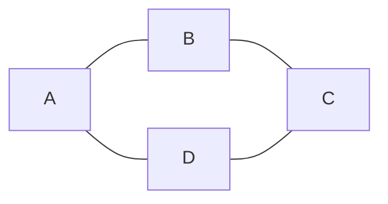
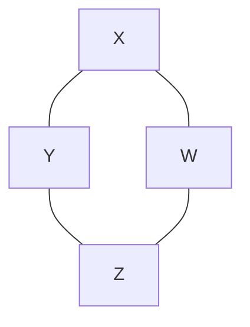

# Isomorphism

Prove that if two graphs $A$ and $B$ have the same number of nodes and are completely connected, they must be isomorphic. I have started with the formal definition of isomorphism below. Add your answer to this markdown file. [This page](https://docs.github.com/en/get-started/writing-on-github/working-with-advanced-formatting/writing-mathematical-expressions)
might help with the notation for mathematical expressions.

$G_1=(V_1 , E_1)$ is isomorphic to $G_2 = (V_2, E_2)$ if there exists a
one-to-one and onto function (bijection) $f: V_1 \rightarrow V_2$ such that $(u,v)
\in E_1$ iff $(f(u),f(v)) \in E_2$.

## Answer

Consider the following two graph templates:

$G_{1} = $



$G_{2} = $



Once again, I am providing some example graphs solely for the benefit of the reader(s) to help them visualize the conditions that this proof is regarding. My reasoning below will be exclusively generalized and only reference $G_{1}$ or $G_{2}$ to be "templates" of any arbitrary graph that is completely connected **and** has an equivalent number of nodes as its pair graph. In other words, $G_{1}$ and $G_{2}$ are arbitrary graphs that satisfy the same conditions as the graphs depicted.

Suppose that $m$ is a mapping between any two arbitrary graphs $G_{1}$ and $G_{2}$. Moreover, suppose that $|N|$ represents the arbitrary *(yet equivalent)* number of nodes in a graph and that $|E|$ represents the arbitrary number of edges in a graph.

First and foremost, we must consider the relationship between edges and nodes in general. Since the graphs are assumed to be completely connected, we can make the generic claim that for any arbitrary number $|N|$ nodes, there **must** be exactly $|E| \equiv |N| - 1$ edges in the same graph. That claim follows from the very definition of *completely connected*. The completely connected property necessitates an edge to exist between any two **pairs** of nodes in a graph. The reason that we subtract one from the number of nodes is because completely connected does **not** implore each node to connect back to itself, hence there being one less edge than there are nodes.

In math notation, we can assert that the following property will always hold for any two graphs that are completely connected:

$$\begin{gather*}
|E| = (|N| - 1)
\end{gather*}
$$

Keeping that property in mind, we may now consider the requirements for two graphs to be isomorphic. In layman's terms, two graphs are isomorphic when there exists a bijective mapping between each edge **and** node of both graphs. In order to satisfy the definition of bijective, the mapping must be **both** surjective (onto) and injective (one-to-one). The property above is imperative to generalizing the presence of surjectivity and injectivity because by defining the number of edges in a graph in terms of the number of nodes, proving isomorphism becomes nigh trivial to do. Consider the following logic, and keep in mind that **it only follows for completely connected graphs**:

```math
\begin{gather*}
& |E| = (|N| - 1) && \text{\{The property from above\}} \\
\implies & (|E|_{G_{1}} \equiv |N|_{G_{1}} - 1) \wedge (|E|_{G_{2}} \equiv |N|_{G_{2}} - 1) \\ \\
& |N|_{G_{1}} \equiv |N|_{G_{2}} && \text{\{We assume the number of nodes in each graph is an equivalent value\}}\\
\implies & (|N|_{G_{1}}- 1) \equiv (|N|_{G_{2}} - 1) \\
\implies & |E|_{G_{1}} \equiv |E|_{G_{2}} && \text{\{The property from above\}} \\
\therefore & (|N|_{G_{1}} \equiv |N|_{G_{2}}) \Leftrightarrow (|E|_{G_{1}} \equiv |E|_{G_{2}}) && \text{*Assuming complete-connectivity} \\
&& \blacksquare
\end{gather*}
```

This proves that whenever we know the number of nodes ($|N|$) in two **completely connected** graphs to be equivalent, we can **always** contrive that the number of edges ($|E|$) will also be equivalent.

Finally, since we can now be sure that the number of nodes **and** the number of edges in any two completely connected graphs are equivalent, we have all the basis we need to guarantee isomorphism. That is, we now know that with precisely the same amount of nodes and edges in both graphs, there most definitely exists some mapping $m$ where every node and edge can **uniquely** map to a corresponding node and edge in the other graph. Moreover, since there are equivalent amounts of nodes and edges in each graph when $m$ uniquely maps each node and edge, nodes or edges cannot possibly be left out. Let us re-visit our graph template's from above while keeping all of those properties in mind.


$G_{1} = $


$G_{2} = $


We can see that these two graphs are indeed isomorphic by applying the following mapping:

$$\begin{gather*}
& m : (G_{1} \twoheadrightarrow G_{2}) \wedge (G_{1} \rightarrowtail G_{2}) \\ \\
& A \xmapsto{m} Z \\
& B \xmapsto{m} Y \\
& C \xmapsto{m} X \\
& D \xmapsto{m} W \\
\end{gather*}
$$

That mapping is obviously bijective. Each input ($A, B, C, D$) maps to exactly one output ($Z, Y, X, W$), and their respective edges also have exactly one mapping as well. Therefore, the mapping $m$ is one-to-one. Moreover, there are **no** edges or nodes in the graph that $m$ does **not** account for, which ensures that $m$ is also onto. Of course, that is one specific case, but we can still generalize it from there.

Suppose we add a node to $G_{1}$, then the completely connected property necessitates that we add an edge between the new node and every other node in $G_{1}$. Mathematically, $|N| = |N| + 1 \implies |E| = |E| + 1$ by the property above. Additionally, we would also have to add another node to $G_{2}$ in order to preserve our assertion that the number of nodes in each graph is equivalent. Since $G_{2}$ is *also* completely connected, the number of edges in $G_{2}$ must also increase **proportionally**. If we opt to subtract a node from $G_{1}$, then we must preserve the equivalence between the number of nodes and subtract **exactly one** node from $G_{2}$. Since we've removed a node, we must also remove all the edges that corresponded to each of those nodes as well. Suppose we add or remove an arbitrary $n$ nodes to $G_{1}$, then we will add or remove a **proportional** amount of $n - 1$ edges to $G_{1}$ as well. Thereafter, in order to preserve our assertions we **must do the same thing** to $G_{2}$.

In conclusion, the **proportional** relationship between edges and nodes is the key to maintaining isomorphism for any generalized pair of graphs. More specifically, the preservation of the completely connected and equivalent number of nodes properties is what "implicitly" guarantees that the two graphs will always be isomorphic. The proof is generalized because I affirm that there is no modification that can be made to $G_{1}$ that will render it non-isomorphic to $G_{2}$ so long as the original two assertions are maintained. 
